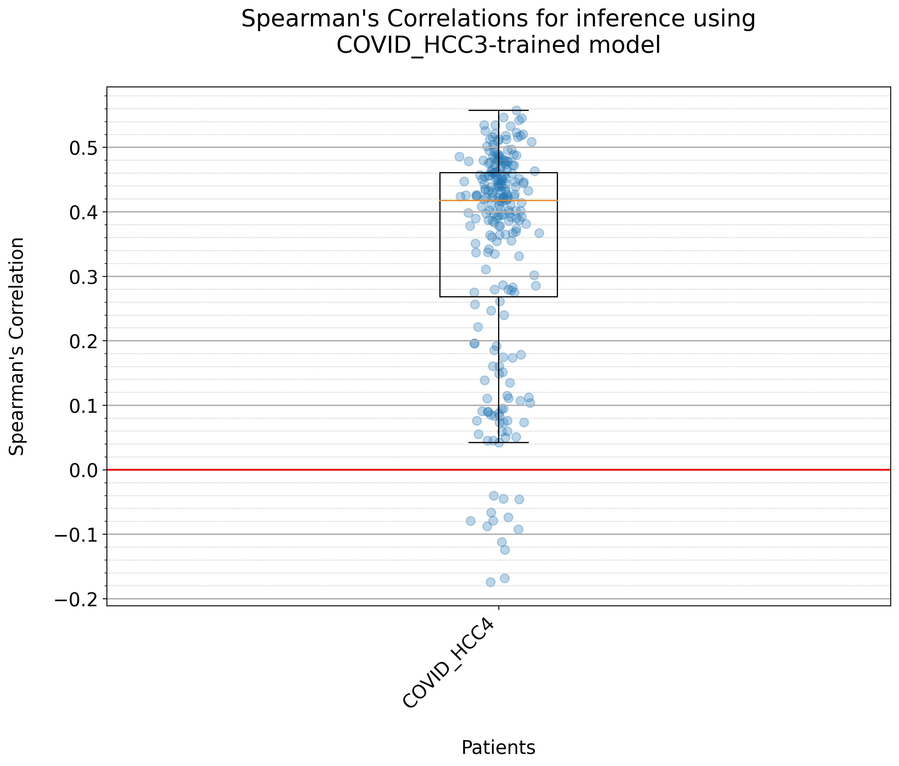
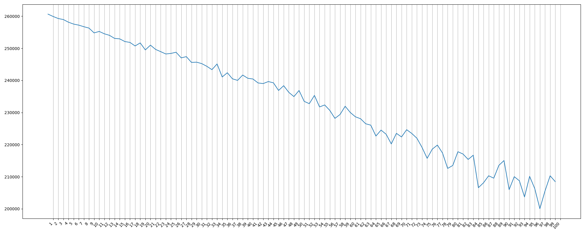
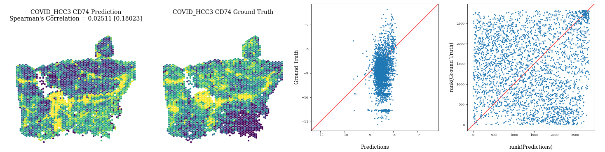

### *You should be able to do most things by running the different scripts in the root directory.*

1: Pre-training
---------------

1. Ensure that data is copied into data/hist2tscript/

    
 Detailed example of data required 

    In summary, 3 CSV/TSV files, compressed as gz, are required + with 1 HnE image (which could be tiled into many, see below.)
    Using example of HCC1 (coded as BC30001, replicate C1) 

    CSV/TSV files:
    --------------
    1. BC30001_C1_Coords.tsv.gz 
    2. BC30001_C1_stdata.tsv.gz
    3. spots_BC30001_C1.csv.gz

    HnE image:
    ----------
    <CASE 1> Using lower-res TIF file (around 4000px*4000px)
    If using lower-res TIF file , TIF image can be loaded directly by openslide. NOTE: Branch individual_window is not set up to do this currently.:
    4. HE_BC30001_C1.tif 

    data
    ├── hist2tscript
    |   ├── BC30001_C1_Coords.tsv.gz
    |   ├── BC30001_C1_stdata.tsv.gz
    |   ├── spots_BC30001_C1.csv.gz
    |   └── HE_BC30001_C1.tif

    <CASE 2> Using full-res TIF file (around 40,000px by 40,000px)
    Openslide cannot load full-res TIF file. Tiling must be done prior to running the model, using the script `crop_to_spot.py` in utilities branch of this repo.
    4. Create directory `HE_BC30001_C1` and copy tiled TIFs inside. The example file tree is shown below.

    data
    ├── hist2tscript
    |   ├── BC30001_C1_Coords.tsv.gz
    |   ├── BC30001_C1_stdata.tsv.gz
    |   ├── spots_BC30001_C1.csv.gz
    |   ├── HE_BC30001_C1
    |   |   ├── BC30001_11_11.tif
    |   |   ├── BC30001_11_13.tif
    |   |   ├── BC30001_11_15.tif
    ...
    |   |   ├── BC30001_117_37.tif
    |   |   ├── BC30001_117_39.tif
    |   |   └── BC30001_117_41.tif
            <3043 TIF files corresponding to 3043 in-tissue spots>

2. Run `prepare_spatial.sh` to save data at spot-level as npz files for faster access during training.

2: Training
-----------
1. Run `training.sh` 

3: Post-training
----------------
- `boxplot.sh`: Plots boxplot of Spearman's correlation for genes with significant correlation. This provides a performance overview of the training.

- `best_loss.sh`: Plots loss against epochs. This can be used to verify if training converges.

- `generate_figures.sh`: Generates figures to visualize model prediction compared with ground truth.

- `clear_spatial.sh`: Removes .pkl files in data/hist2tscript and data/hist2tscript-patch directory. Used if you wish to change the data for training and testing. After clearing spatial, you must run `prepare_spatial.sh` (with the new data) before running training again.